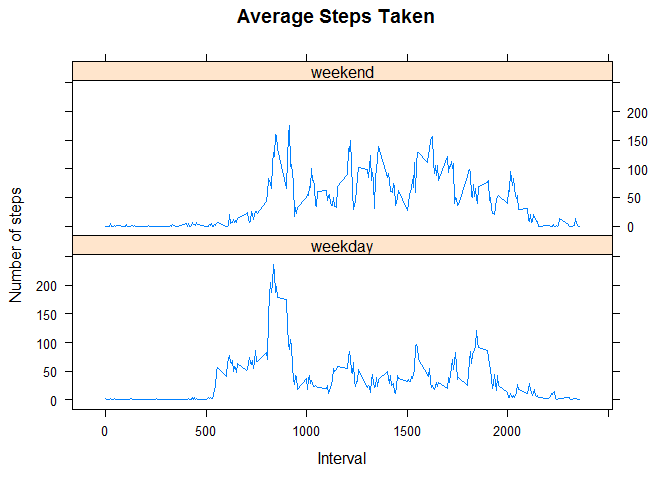

# Reproducible Research: Peer Assessment 1


## Loading and preprocessing the data
First clean up the current environment, then load the data removing any rows with missing datasets

```r
#clean the evironment
rm(list=ls())
#load the csv from the zip file
rawdata <- read.csv(unz("activity.zip","activity.csv"))
if(!file.exists("figure")){
  dir.create("figure")
}
#preprocess the data removing missing data
data <- subset(rawdata,!is.na(rawdata$steps))
names(data)
```

```
## [1] "steps"    "date"     "interval"
```

```r
str(data)
```

```
## 'data.frame':	15264 obs. of  3 variables:
##  $ steps   : int  0 0 0 0 0 0 0 0 0 0 ...
##  $ date    : Factor w/ 61 levels "2012-10-01","2012-10-02",..: 2 2 2 2 2 2 2 2 2 2 ...
##  $ interval: int  0 5 10 15 20 25 30 35 40 45 ...
```

```r
head(data)
```

```
##     steps       date interval
## 289     0 2012-10-02        0
## 290     0 2012-10-02        5
## 291     0 2012-10-02       10
## 292     0 2012-10-02       15
## 293     0 2012-10-02       20
## 294     0 2012-10-02       25
```

```r
summary(data)
```

```
##      steps                date          interval     
##  Min.   :  0.00   2012-10-02:  288   Min.   :   0.0  
##  1st Qu.:  0.00   2012-10-03:  288   1st Qu.: 588.8  
##  Median :  0.00   2012-10-04:  288   Median :1177.5  
##  Mean   : 37.38   2012-10-05:  288   Mean   :1177.5  
##  3rd Qu.: 12.00   2012-10-06:  288   3rd Qu.:1766.2  
##  Max.   :806.00   2012-10-07:  288   Max.   :2355.0  
##                   (Other)   :13536
```

## What is mean total number of steps taken per day?

```r
#get the sum of the daily steps
dailySteps <- aggregate(steps~date,data,sum)
op <- par(mfrow=c(1,2))
hist(log10(dailySteps$steps),xlab = "Daily steps x 10",main="Histogram - Daily steps")
myplot<-barplot(log10(dailySteps$steps),ylim=c(0,5),xlab="Date",ylab="Daily steps x 10",main="Barplot - Daily Steps")
axis(1,at=myplot,labels=dailySteps$date)
```

 

```r
par(op)
dev.copy(png,"figure/1.png")
```

```
## png 
##   3
```

```r
dev.off()
```

```
## png 
##   2
```

```r
message(sprintf("Mean of total daily steps %f ",mean(dailySteps$steps)))
```

```
## Mean of total daily steps 10766.188679
```

```r
message(sprintf("Median of total daily steps %f ",median(dailySteps$steps)))
```

```
## Median of total daily steps 10765.000000
```

## What is the average daily activity pattern?
1. Time series plot

```r
averageDailySteps <- aggregate(steps~date,data,mean)
plot(averageDailySteps$steps,type="l",main="Daily Activity Pattern",ylab="Average Daily Steps",xlab="Date",xaxt="n")
axis(1,at=averageDailySteps$date,labels=averageDailySteps$date)
```

 

```r
dev.copy(png,"figure/2.png")
```

```
## png 
##   3
```

```r
dev.off()
```

```
## png 
##   2
```
2. Across the dataset, the 5-minute interval across all the days with maximum number of steps

```r
interval_aggregate=aggregate(steps~interval,data,mean,omit.na=TRUE)
interval_aggregate[which(interval_aggregate$steps==max(interval_aggregate$steps)),]
```

```
##     interval    steps
## 104      835 206.1698
```

## Imputing missing values
1. Calculate the total number of missing values in dataset. 2304
2. Using mean for 5 minute interval by weekday strategy for filling in missing dataset
3. Create new dataset with missing data filledin

```r
#copy the data
data2 = data
new_dataset=rawdata
#determine the day of the week
data2$weekday=weekdays(as.POSIXct.default(data2$date))
new_dataset$weekday=weekdays(as.POSIXct.default(new_dataset$date))
#determine the average by day of week and interval
weekday_time_interval_aggregate=aggregate(steps~interval+weekday,data2,mean)
missing_steps=which(is.na(new_dataset$steps))
for (index in missing_steps) { 
  #match the weekday and 5 minute interval
  matched_index=which(weekday_time_interval_aggregate$interval==new_dataset[index,]$interval & weekday_time_interval_aggregate$weekday==new_dataset[index,]$weekday)  
  if(is.numeric(matched_index)){
    new_dataset[index,]$steps=weekday_time_interval_aggregate[matched_index,]$steps
  }
}
#check number of missing steps
length(which(is.na(new_dataset$steps)))
```

```
## [1] 0
```
4. Create histogram and compute mean and median. There the frequency, mean and median when data is missing is lower.

```r
dailySteps <- aggregate(steps~date,new_dataset,sum)
hist(log10(dailySteps$steps),xlab = "Daily steps x 10",main="Histogram - Daily steps (New Dataset)")
```

 

```r
dev.copy(png,"figure/3.png")
```

```
## png 
##   3
```

```r
dev.off()
```

```
## png 
##   2
```

```r
message(sprintf("Mean of total daily steps %f ",mean(dailySteps$steps)))
```

```
## Mean of total daily steps 10821.209602
```

```r
message(sprintf("Median of total daily steps %f ",median(dailySteps$steps)))
```

```
## Median of total daily steps 11015.000000
```

## Are there differences in activity patterns between weekdays and weekends?

```r
isWeekdayOrWeekend <- function(strDate){
  ifelse( weekdays(as.POSIXct.default(strDate)) %in% c("Saturday","Sunday"), "weekend","weekday")
}
#assign new
new_dataset$day=isWeekdayOrWeekend(new_dataset$date)
new_dataset_mean = aggregate(steps~interval+day,new_dataset,mean)
require(lattice)
```

```
## Loading required package: lattice
```

```
## Warning: package 'lattice' was built under R version 3.1.3
```

```r
xyplot(steps ~ interval|day, data=new_dataset_mean,layout=c(1,2),type="l",main = "Average Steps Taken",ylab="Number of steps",xlab="Interval")
```

 

```r
dev.copy(png,"figure/4.png")
```

```
## png 
##   3
```

```r
dev.off()
```

```
## png 
##   2
```
